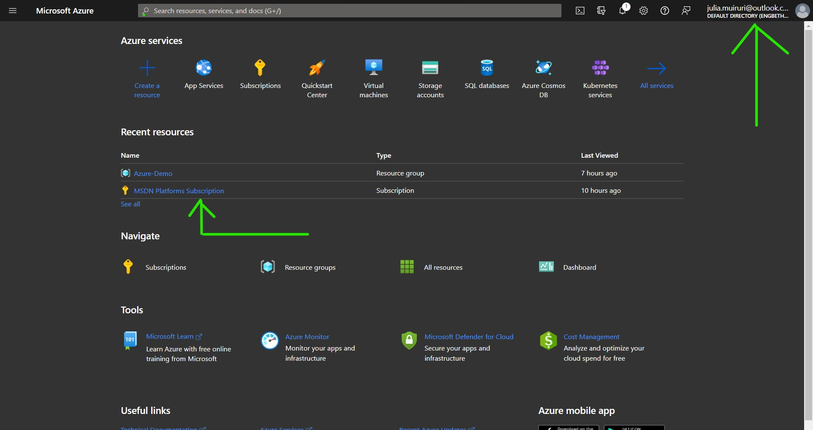
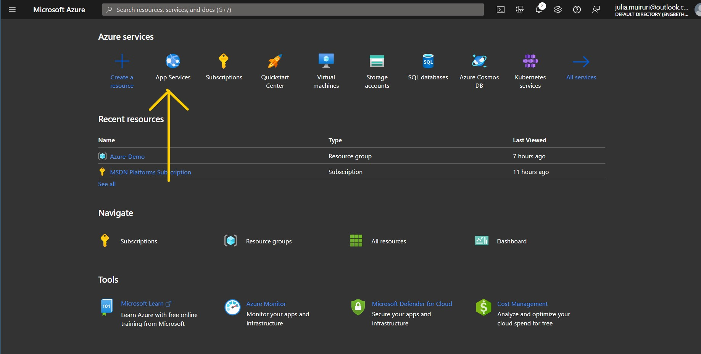
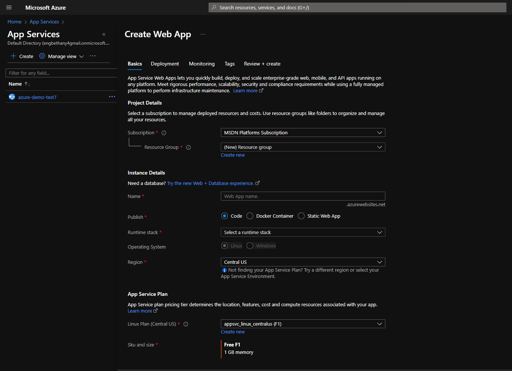
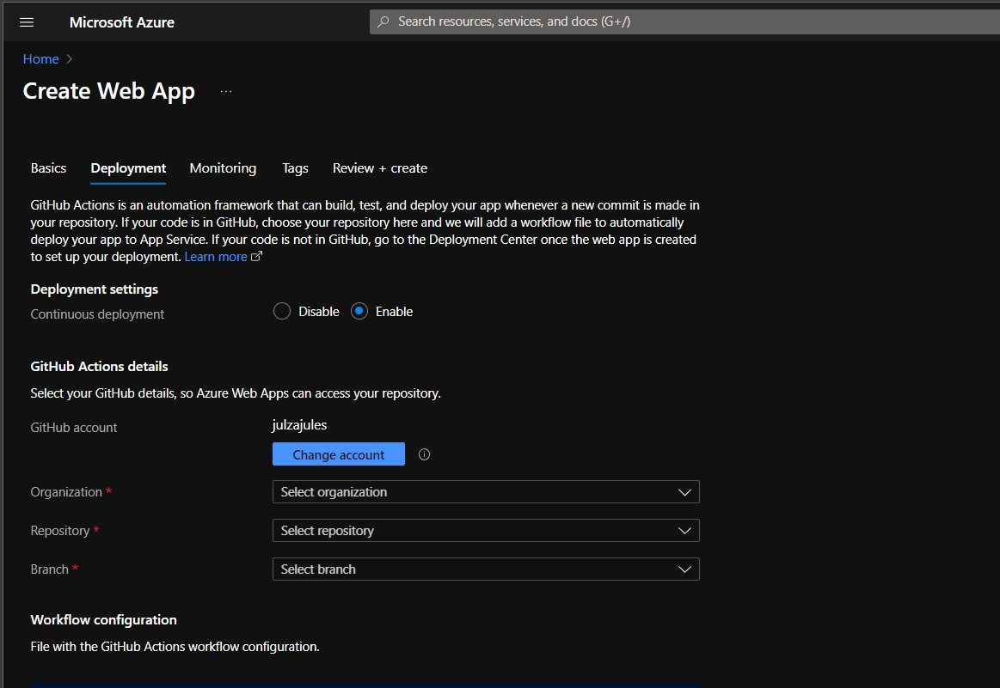
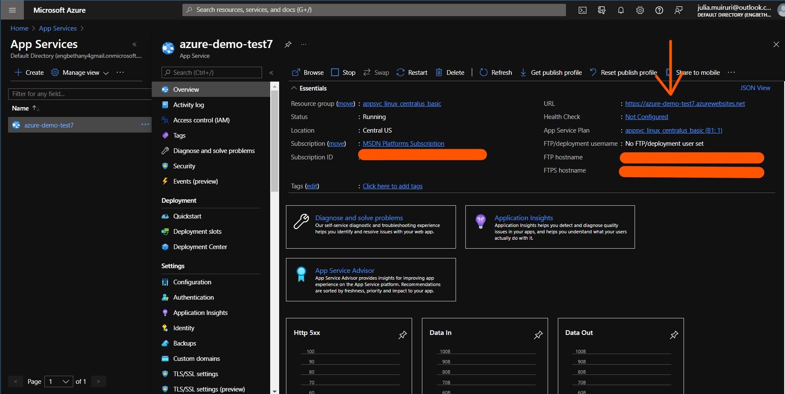

# Deploying your application to Azure App Service
## Prerequisites

- Code Editor (Visual Studio Code)
- Microsoft Azure Subscription

### `Step 1 : Prepare the project to be deployed on Visual Studio Code.`

Runs the app in the development mode to ensure it contains no errors.

Open [http://localhost:3000](http://localhost:3000) to view it in your browser.

The page will reload when you make changes.\
You may also see any lint errors in the console.

### `Step 2 : Push your project to a repository on GitHub.`

Why this step? 
We shall set up a GitHub workflow that will automatically re-deploy your application whenever code is pushed to the master branch. With this configured, you do not have to keep re-deploying your application manually.

Useful Azure Extensions that allow you to work with GitHub in Visual Studeio Code. 
- GitLens - Git supercharged
- Source Control Buttons

### `Step 3 : Navigate to the Azure portal to create your resource`
Open [Azure portal](https://portal.azure.com) and sign in with an email with an Azure Subscription.

 

If you do not have an Azure Subscription and you are an active university/college student, you can [activate a Free Azure Account](https://azure.microsoft.com/en-us/free/students/) using your school email address, no credit card information required.

To host an application on Azure, you need to create an App Service as shown below

During the Web App Configuration, you need to provide the following specifications:
> 
- Select the Subscription to host your application
- Provide a resource group (logical container) to which your application will be saved
- Provide a Web App Name. This needs to be a globally unique name as it appears on the app's url after deployment [Web-App-Name].azurewebsites.net

Please note you can configure a custom domain for your application on Azure. Kindly see [custom dns documentation](https://docs.microsoft.com/en-us/azure/app-service/manage-custom-dns-buy-domain)
- For this guide, we have our codebase in GitHub, so select 'code' as your publish item.

Please note, based on where your project resides, you can select either 'code', if it is on GitHub, or 'docker container' or a 'static web app'
- Select your project's runtime stack (ie. Node 14 TLS)
- Select preferred Operating System to host your resource
- Select an Azure region to which you would like to host your resource.

Please note, the region's availability depends on the App Service Plan you intend to use (ie. A free B1 plan is not available for a Linix Based App Service in West Europe but a Window's based App Service in the same region can run on a free B1 plan) 

Learn more about [Azure Regions and availability zones here](https://docs.microsoft.com/en-us/azure/availability-zones/az-overview)

> 
- Configure a GitHub workflow using GitHub Actions to automatically re-deploy your application once code is pushed to the master branch.

Learn more on [GitHub Actions](https://github.com/features/actions) here
- If you prefer, you can enable Application Insights Service, an Application Performance Management (APM) Service that enables you to monitor your application (ie. traffic)
- Once done, click 'Review and Create'

## Congratulations!! - You have just created your first Azure Web App!

### `Step 4 : Navigate to [Web-App-Name].azurewebsites.net to access your live application`

You can easily click browse on the Web App as shown above and you will be redirected to your live application.